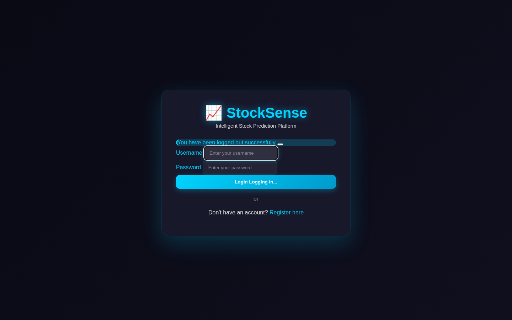
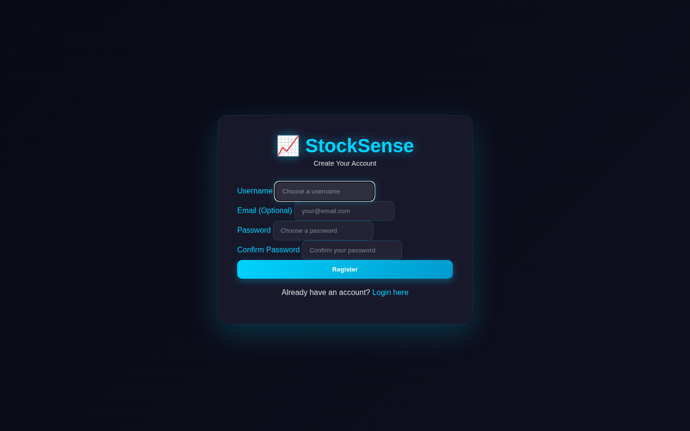
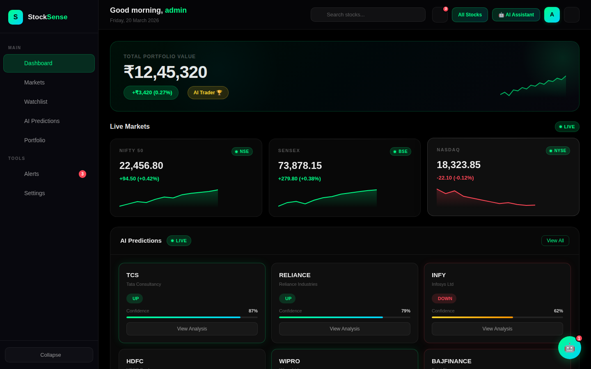
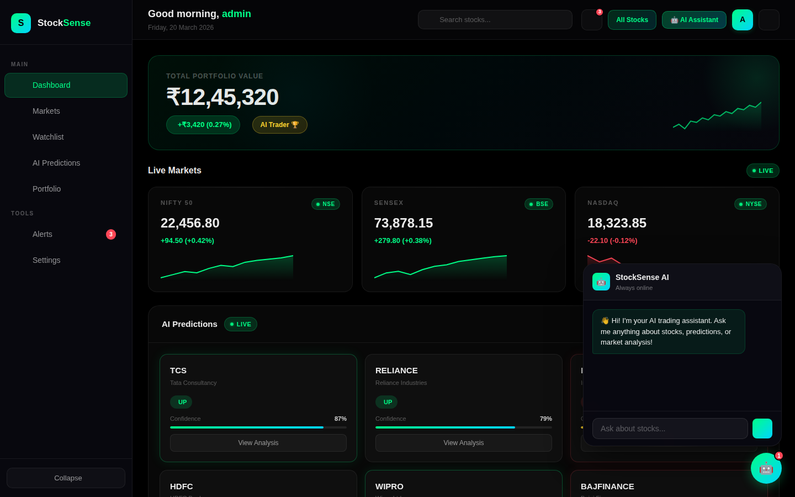
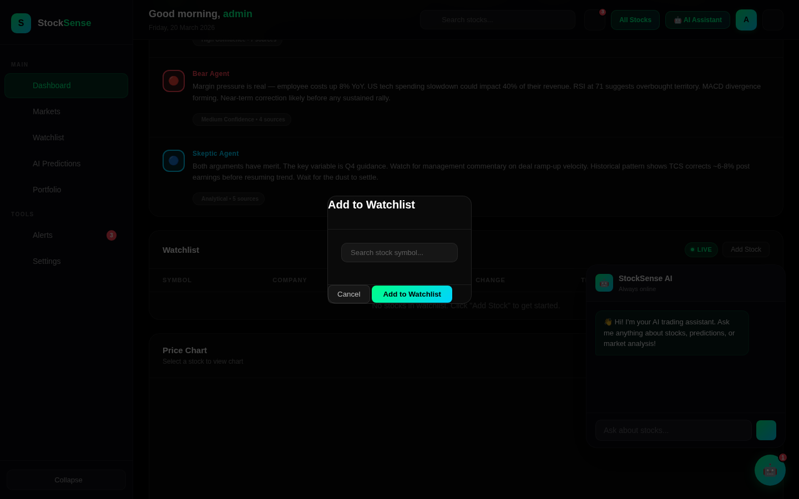
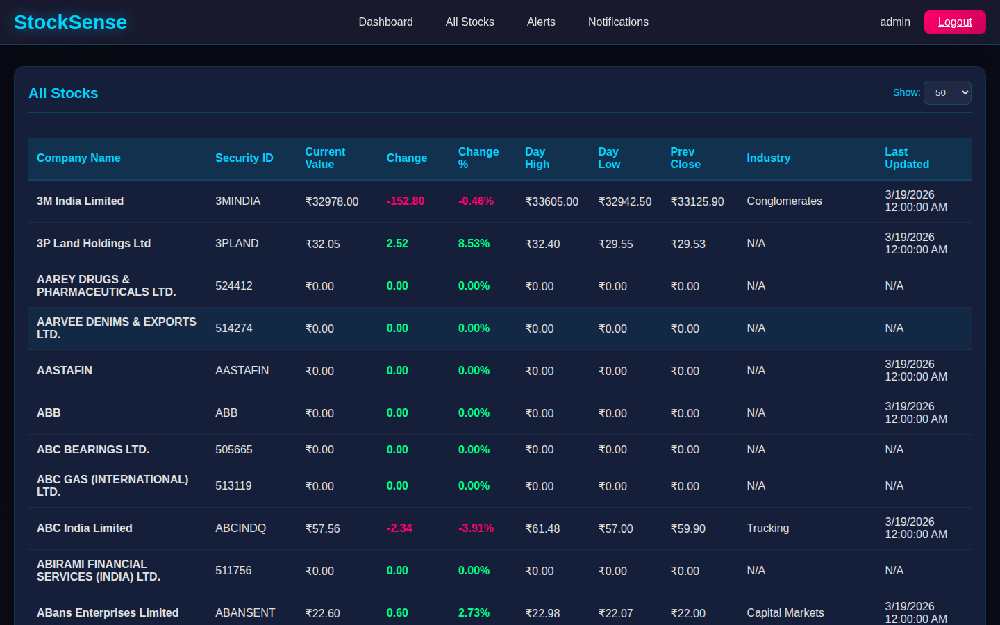
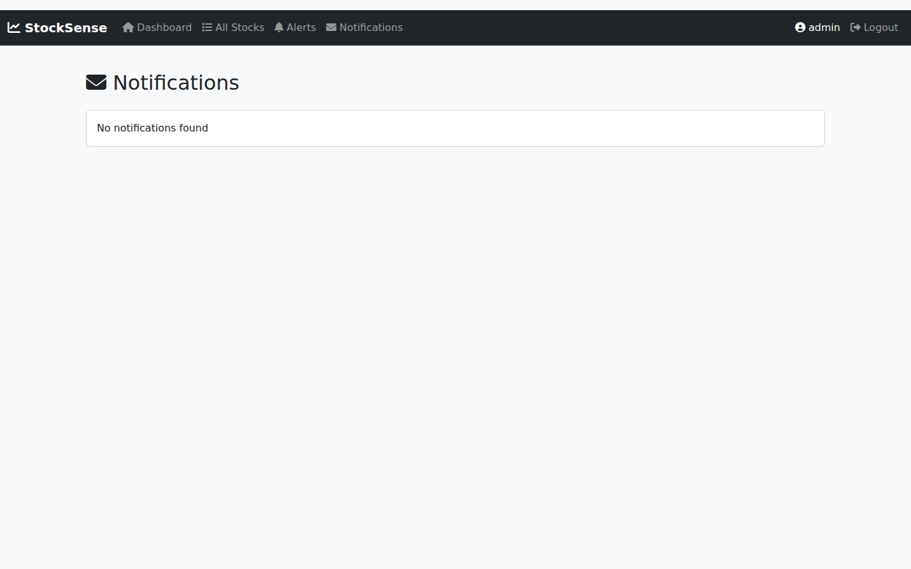
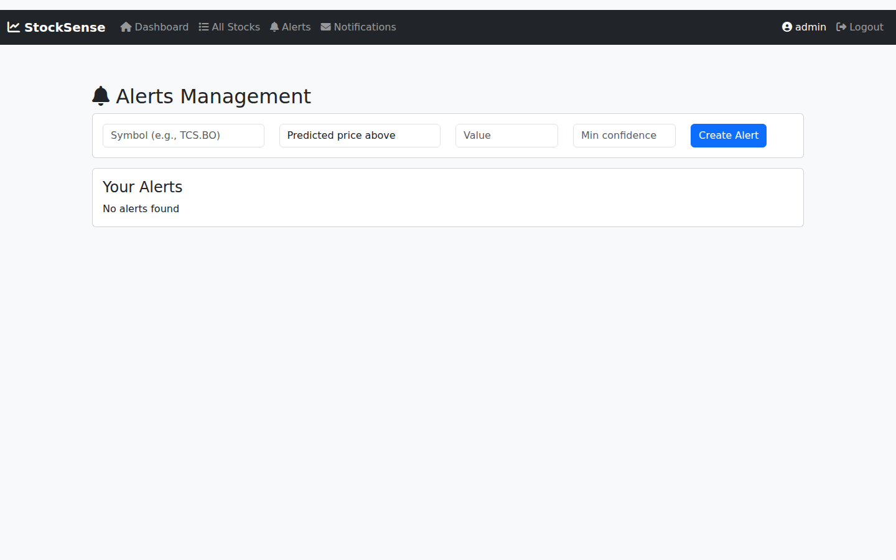
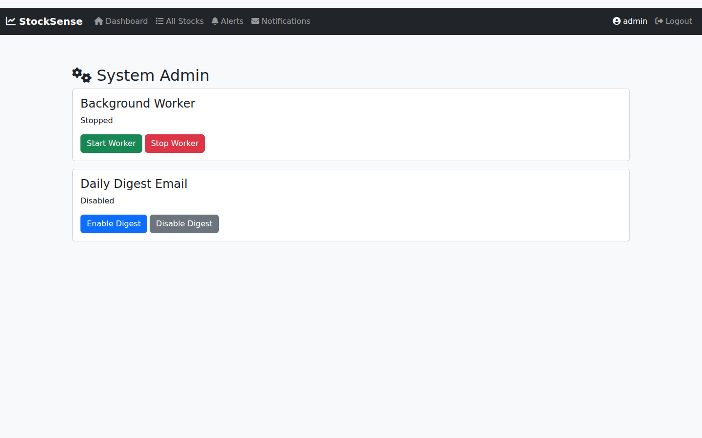

# StockSense — UI Screenshots

This directory contains screenshots of every UI page and interactive element in the StockSense application, captured at **1440×900** resolution for design verification.

---

## Pages Overview

| # | Page | Route | Template |
|---|------|--------|----------|
| 1 | Login | `/login` | `login.html` |
| 2 | Register | `/register` | `register.html` |
| 3 | Dashboard | `/dashboard` | `dashboard.html` |
| 4 | Dashboard — AI Chat Panel | `/dashboard` | `dashboard.html` |
| 5 | Dashboard — Add to Watchlist Modal | `/dashboard` | `dashboard.html` |
| 6 | All Stocks | `/stocks` | `stocks_list.html` |
| 7 | Notifications | `/notifications` | `notifications.html` |
| 8 | Alerts Management | `/alerts` | `alerts_mgmt.html` |
| 9 | System Admin | `/admin` | `admin_system.html` |

---

## Screenshots

### 1. Login Page

- Dark gradient background with green/teal accent
- StockSense logo with tagline "Intelligent Stock Prediction Platform"
- Username and password fields
- "Login" button with loading state
- Link to registration page

---

### 2. Register Page

- Matches login page dark theme
- Fields: Username, Email (optional), Password, Confirm Password
- "Register" submit button
- Link back to login

---

### 3. Dashboard — Main View

- **Left sidebar** navigation: Dashboard, Markets, Watchlist, AI Predictions, Portfolio, Alerts (with badge), Settings, Collapse button
- **Top bar**: Greeting with date, stock search, notification bell, "All Stocks" link, AI Assistant button, user avatar, Logout
- **Portfolio Value card** with sparkline chart
- **Live Markets** ticker: NIFTY 50, SENSEX, NASDAQ with real-time values
- **AI Predictions** cards: TCS (87%), RELIANCE (79%), INFY (62%), HDFC (55%), WIPRO (91%), BAJFINANCE (68%)
- **Agent Reasoning Feed**: Bull Agent 🟢, Bear Agent 🔴, Skeptic Agent 🔵 analysis
- **Watchlist table** with empty state
- **Price Chart** area with 1D/1W/1M/1Y time filters + RSI/MACD/Volume indicators
- **AI Insights Feed** with timestamped predictions
- **Recent Activity** trade history
- **Risk Alerts & Protection** panel with trigger status
- **System Status** panel (WebSocket, Data Feed, AI Engine, Uptime)

---

### 4. Dashboard — AI Chat Panel

- Floating AI Assistant chat panel (bottom-right)
- StockSense AI avatar with "Always online" status
- Welcome message: "Hi! I'm your AI trading assistant..."
- Text input: "Ask about stocks..."
- Chat bubble badge on floating robot button

---

### 5. Dashboard — Add to Watchlist Modal

- Modal overlay with "Add to Watchlist" title
- Stock symbol search input
- Cancel and "Add to Watchlist" action buttons

---

### 6. All Stocks Page

- Dark-themed data table with BSE/NSE stock list
- Columns: Company Name, Security ID, Current Value, Change, Change %, Day High, Day Low, Prev Close, Industry, Last Updated
- Real stock data loaded (2000+ records from BSE/NSE)
- Color-coded change values: green (positive), red (negative)
- Show dropdown (50 per page)
- Sortable columns, pagination controls

---

### 7. Notifications Page

- Bootstrap-styled page with dark navbar
- Navigation: Dashboard, All Stocks, Alerts, Notifications
- Empty state: "No notifications found"
- Will show alert-triggered notifications when alerts fire

---

### 8. Alerts Management Page

- Alert creation form:
  - Symbol input (e.g. TCS.BO)
  - Alert type dropdown: Predicted price above/below, Predicted change above %
  - Value input
  - Min confidence (0–1)
  - "Create Alert" button
- "Your Alerts" section (empty state: "No alerts found")

---

### 9. System Admin Page

- Admin-only page (403 for non-admin users)
- **Background Worker** control: Start/Stop buttons with live status
- **Daily Digest Email** control: Enable/Disable with live status

---

## Design Notes

### Theme Architecture
The application uses **two visual themes**:

| Theme | Pages | Technology |
|-------|-------|------------|
| **Dark Trading Theme** | Dashboard, Login, Register, Stocks List | Custom CSS with CSS variables (`--primary-color: #00d4ff`) |
| **Bootstrap Light Theme** | Notifications, Alerts, Admin | Bootstrap 5.3.2 with dark navbar |

### Local Asset Fix
During this UI review, CDN dependencies in `base.html` were replaced with locally-served static files to ensure pages render correctly in offline/network-restricted environments:

| Before (CDN) | After (Local) |
|---|---|
| `cdn.jsdelivr.net/npm/bootstrap@5.3.2/dist/css/bootstrap.min.css` | `/static/bootstrap.min.css` |
| `cdn.jsdelivr.net/npm/bootstrap@5.3.2/dist/js/bootstrap.bundle.min.js` | `/static/bootstrap.bundle.min.js` |
| `cdnjs.cloudflare.com/.../font-awesome/.../all.min.css` | `/static/vendor/fontawesome/css/all.min.css` |
| `code.jquery.com/jquery-3.6.0.min.js` | `/static/jquery.min.js` |

### Interactive Elements Verified
- ✅ Login form submission with redirect
- ✅ Logout with session clearance and flash message
- ✅ Dashboard portfolio value widget
- ✅ Live markets ticker (NIFTY 50, SENSEX, NASDAQ)
- ✅ AI Predictions cards (6 stocks with confidence bars)
- ✅ Agent Reasoning Feed (Bull/Bear/Skeptic agents)
- ✅ Add to Watchlist modal
- ✅ AI Chat panel (floating assistant)
- ✅ Price chart time-range controls
- ✅ Technical indicator cards (RSI, MACD, Volume)
- ✅ AI Insights Feed with timestamps
- ✅ Risk Alerts panel with triggered state
- ✅ System Status panel
- ✅ Stocks list table with real BSE/NSE data
- ✅ Alert creation form
- ✅ Admin background worker controls
- ✅ Admin digest email controls
